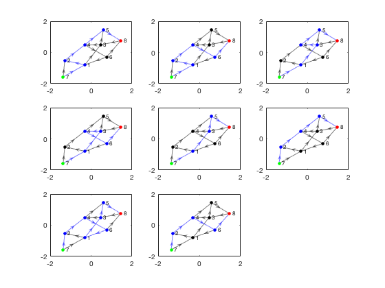

# pathbetweennodes.m

This package provides a Matlab function to calculate all pathways between two nodes in a network graph.

## Installation

To use, add the `pathbetweennodes-pkg/pathbetweennodes` folder to your Matlab path, or copy the `pathbetweennodes.m` file from that folder to a folder already on your Matlab path.

The plotting portion of the example below requires R2015b or later.  However, the `pathbetweennodes` function itself should work in older versions as well.

## Syntax

```
pth = pathbetweennodes(adj, src, snk)
pth = pathbetweennodes(adj, src, snk, vflag)
```

See function help for description of input and output variables.

## Example

```matlab
% Build graph

s = [1 1 2 3 3 4 4 6 6 7 8 7 5]';
t = [2 3 4 4 5 5 6 1 8 1 3 2 8]';

nnode = max(s);
nedge = length(s);

adj = sparse(s,t,ones(nedge,1),nnode,nnode);

% Calculate paths

pth = pathbetweennodes(adj,7,8);

% Plot all paths

G = digraph(adj);
figure;
for ii = 1:length(pth)
    subplot(3,3,ii);
    h(ii) = plot(G, 'edgecolor', 'k', 'nodecolor', 'k');
    highlight(h(ii), pth{ii}, 'edgecolor', 'b', 'nodecolor', 'b'); 
    highlight(h(ii), 7, 'nodecolor', 'g');
    highlight(h(ii), 8, 'nodecolor', 'r');
end
```

